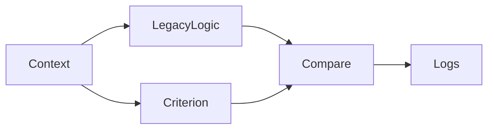

# Integration Patterns

## 1. Overview

Criterion does NOT replace your services, DB, or API.
It integrates as a **decision layer**.

Canonical flow:

```
UI → API → Services → Context Builder → Criterion → Result → UI
```

## 2. Context Builder Pattern

The **Context Builder** is responsible for:
- Fetching data from services/DB
- Normalizing values
- Validating constraints
- Producing an **immutable context** for Criterion

```ts
const context = await buildContext(userId, request)
const result = engine.run(decision, context, { profile })
```

Criterion never fetches data.
The Context Builder does.

## 3. Decision Profiles in Integration

Profiles are injected explicitly at runtime.

```ts
engine.run(decision, context, {
  profile: "stable-economy"
})
```

Important rules:
- Profiles are NOT inferred by the engine
- Profiles are NOT embedded in context
- Profiles are NOT implicit defaults

Profile selection belongs to the host system.

Criterion only reports:
- which profile was used
- how it affected evaluation

## 4. Shadow Mode (Recommended for Adoption)

Criterion should be introduced without breaking existing logic.

**Shadow Mode Pattern:**



Steps:
1. Run existing logic (production)
2. Run Criterion in parallel (shadow)
3. Compare outputs
4. Log divergences
5. Iterate until aligned

Never do a big-bang rewrite.

## 5. Result Handling

Criterion returns a structured result:

```ts
{
  status: "OK" | "NO_MATCH" | "INVALID_INPUT" | "INVALID_OUTPUT",
  data: { ... } | null,
  meta: {
    matchedRule: "rule-id",
    evaluatedRules: [...],
    explanation: "...",
    profile: "high-inflation"
  }
}
```

The host system:
- Reads `status`
- Reads `data` (if OK)
- Logs or displays `meta.explanation`
- Does NOT modify the result

## 6. Error Handling

Criterion does not throw exceptions for business logic.

| Status | Meaning |
|--------|---------|
| OK | Decision matched, output valid |
| NO_MATCH | No rule matched |
| INVALID_INPUT | Input failed validation |
| INVALID_OUTPUT | Output failed validation |

The host system handles errors based on status.

## 7. Multiple Decisions in Sequence

Example: Evaluate a user for a transaction.

1. Evaluate user eligibility
2. Evaluate pricing tier
3. Evaluate transaction limits

Each decision:
- has its own context
- has its own profile
- produces its own explanation

Decisions should not depend on each other implicitly.

## 8. Testing Strategy

Criterion enables deterministic testing.

Recommended tests:
- Same context + profile → same result
- Invalid input → INVALID_INPUT
- Profile swap → expected behavior change
- Rule order correctness

Because Criterion has no side effects, tests are fast and isolated.

## 9. Production Readiness Checklist

Before using Criterion in production:
- [ ] Context Builder validates all inputs
- [ ] Profiles are explicit and versioned
- [ ] Decisions are versioned
- [ ] Shadow mode has been tested
- [ ] Explanations are logged or observable
- [ ] No side effects exist in rules

## 10. Key Principle (Non-negotiable)

**Criterion decides.**
**The system executes.**

If Criterion starts executing, orchestrating, or fetching,
it is no longer Criterion.
